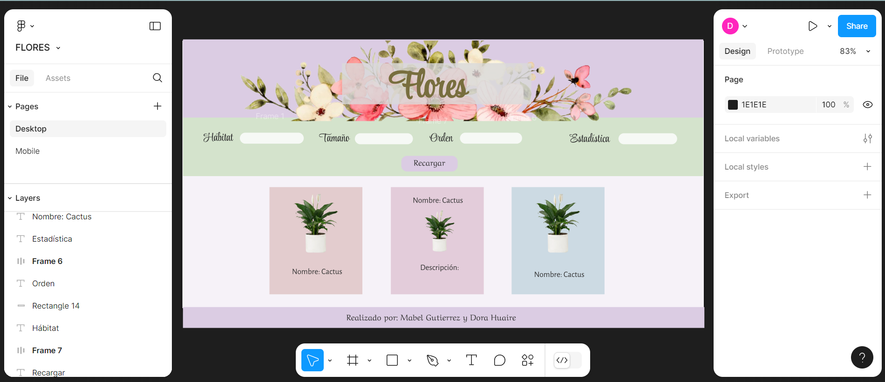
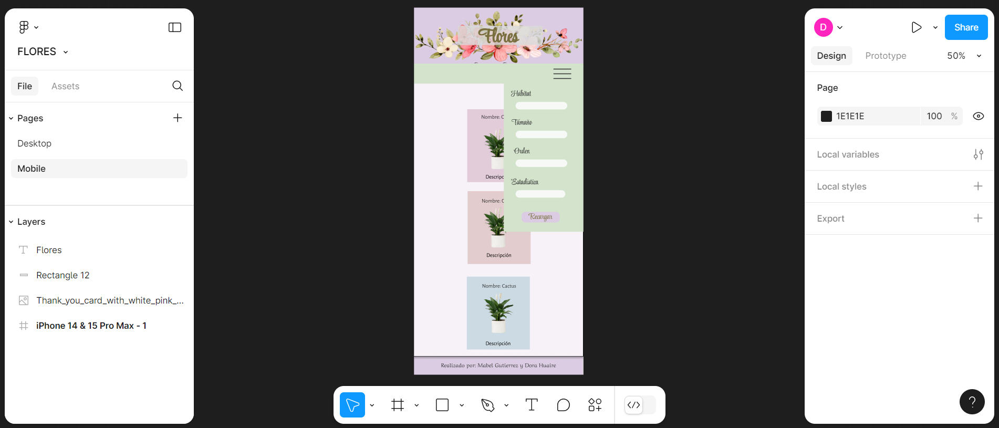
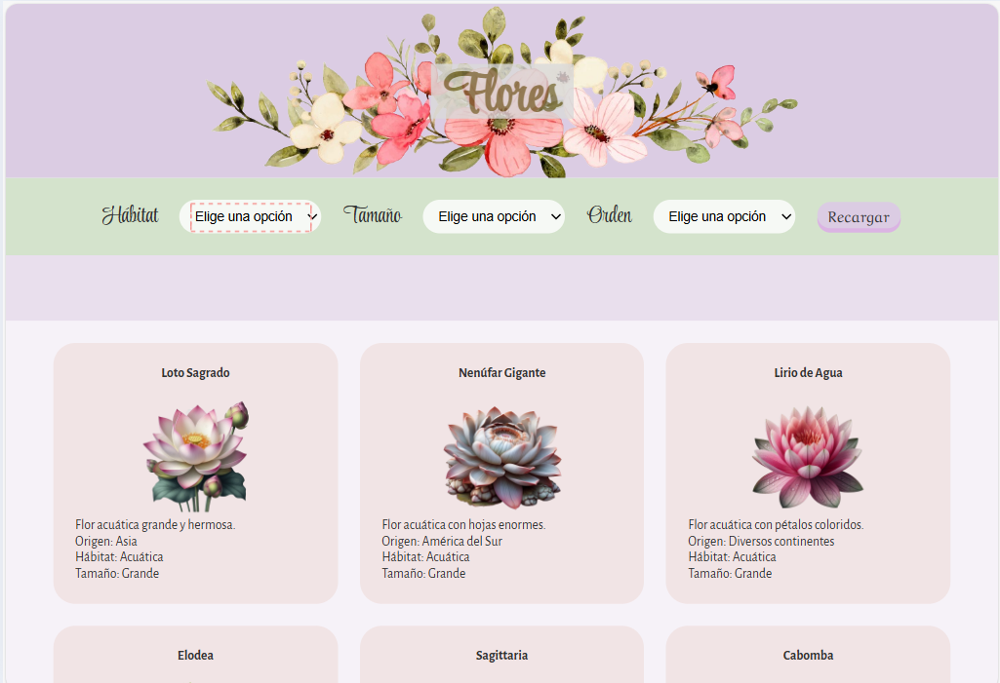
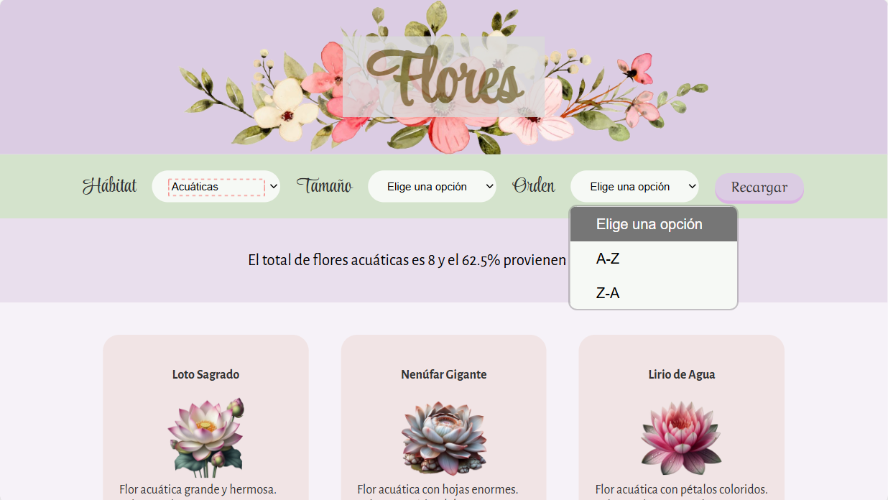
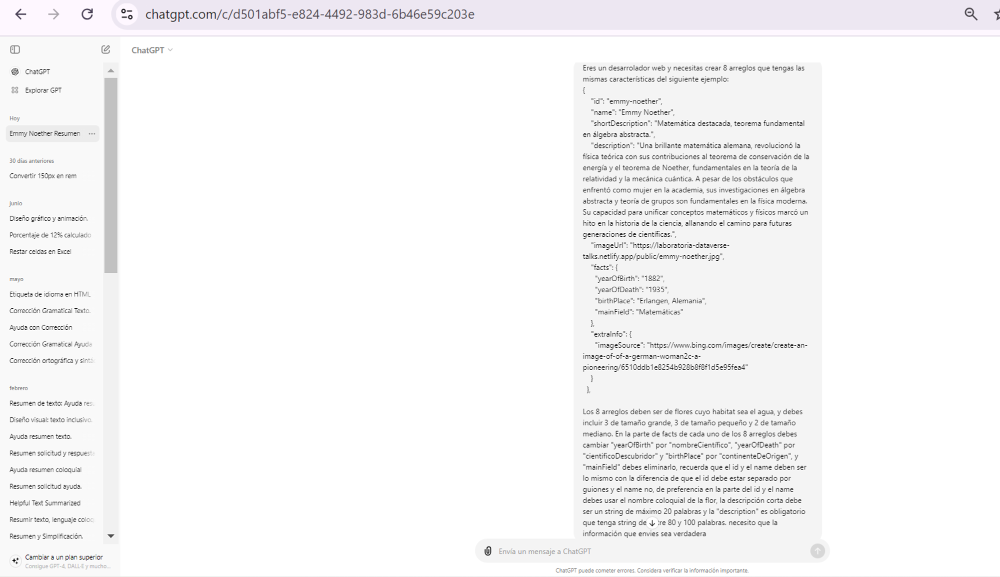
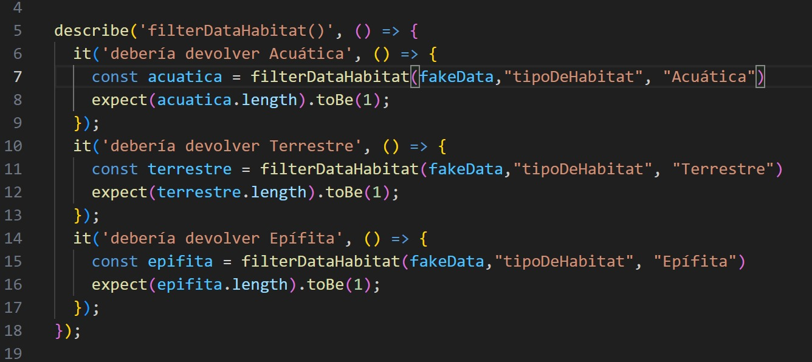

# Flores Dataverse 

## Índice

* [1. Resumen del proyecto](#1-resumen-del-proyecto)
* [2. Funcionalidades](#2-funcionalidades)
* [3. Historias de Usuaria](#3-historias-de-usuaria)
* [4. Hitos](#4-hitos)

***

## 1. Resumen de proyecto

Según [Forbes](https://www.forbes.com/sites/bernardmarr/2018/05/21/how-much-data-do-we-create-every-day-the-mind-blowing-stats-everyone-should-read),
el 90% de la data que existe hoy ha sido creada durante los últimos dos años.
Cada día generamos 2.5 millones de terabytes de datos, una cifra sin
precedentes.

Por eso hemos creado una página dinámica llamada Flores Dataverse, que permite a las usuarias visualizar, ordenas, filtrar y calcular toda la información de sus flores preferidas de manera simple.

En la siguiente imagen, podemos ver el prototipo que se diseñamos al iniciar el proyecto.

## 2. Funcionalidades

La página web contine 24 tarjetas y cada una de ellas, contiene información relevante de cada flor.

Además, permite a la usuaria filtrar las flores de acuerdo al hábitat (acuática, terreste y epífita) y el tamaño (pequeña, mediana y grande), y le permite ordenar alfabéticamente de manera ascendente y descendente.

También la página está diseñada para calcular estadísticas del número de flores y el porcentaje de flores de acuerdo a su continente de origen. 

## 3. Historias de Usuaria

1. ¿Quiénes son las principales usuarias del producto?
    
   Personas amantes de la naturaleza, interesadas en aprender más sobre flores.
    
2. ¿Cuáles son los objetivos de estas usuarias en relación con el producto?

   Aprender y conocer más sobre distintas flores, de diversos hábitats, tamaños y continentes.
    
3. ¿Cuáles son los datos más relevantes que quieren ver en la interfaz y por qué?

    Hábitat, tamaño y continente de origen, porque si alguna usuria está interesada en cultivar alguna de esás flores, tiene la información adecuada para hacerlo.

4. ¿Cuándo utilizan o utilizarían el producto?
   
   Cuando busquen más información sobre flores de diversas partes del mundo y cuando quieran aprender sobre flores.

## 4. Hitos

A continuación, relatamos lo trabajado en cada hito:

### Hito 1

1. Preparamos el área de trabajo: hicimos fork, clonamos proyecto e instalamos dependencias.
2. Organizamos información.
3. Definimos el tema de proyecto y construimos el prototipo para desktop y mobile.
5. Preparamos el prompt en chatGPT.
6. Ejecutamos pruebas para dataset.js.
7. Unimos los cambios de hito-1 con la rama main, después creamos una nueva rama llamada hito-2 y a partir de ella trabajamos las funcionalidades.

### Hito 2

1. En view.js incorporamos el código que nos permite visualizar la data de dataset.js, para iterar sobre la data utilizamos un bucle, y otros métodos.
2. Incorporamos el HTML mínimo que consideramos importante para nuestra página principal.
3. Aplicamos los primeros estilos en CSS, a las tarjetas y al header para su mejor visualización, utilizando flexbox.
4. Pasamos las pruebas de npm run test:oas de HTML, CSS y Js.

### Hito 3

1. Utilizando el método filter, logramos realizar el primer filtro que muestra las flores según su tipo de hábitat, luego desarrollamos un segundo filtro para las flore según su tamaño.
2. Escribimos los test de ambos filtros utilizando JEST, que es una biblioteca de JavaScript para crear, ejecutar y estructurar pruebas.

3. Realizamos el método sort para ordenar la data de forma ascendente y descendente.
4. Escibimos el test de la función ordenar en dataFunction.spec.js.
5. Completamos estilos para los filtros en CSS.
6. Pasamos los test OAS para asegurarnos de buen funcionamiento de nuestrá página.

### Hito 4

1. Desarrollamos una función llamada computeStats que permite calcular el número de flores de acuerdo al filtro que se esté aplicando (hábitat y tamaño).
2. Después desarrollamos una segunda función llamada compuStatsPorcentaje, que nos permite visualizar el procetaje de flores según su continente de origen.
3. Escribimos el test de cada uno de las estadísticas.
4. Finalmente ejecutamos test OAS y todas pasaron al 100%.

